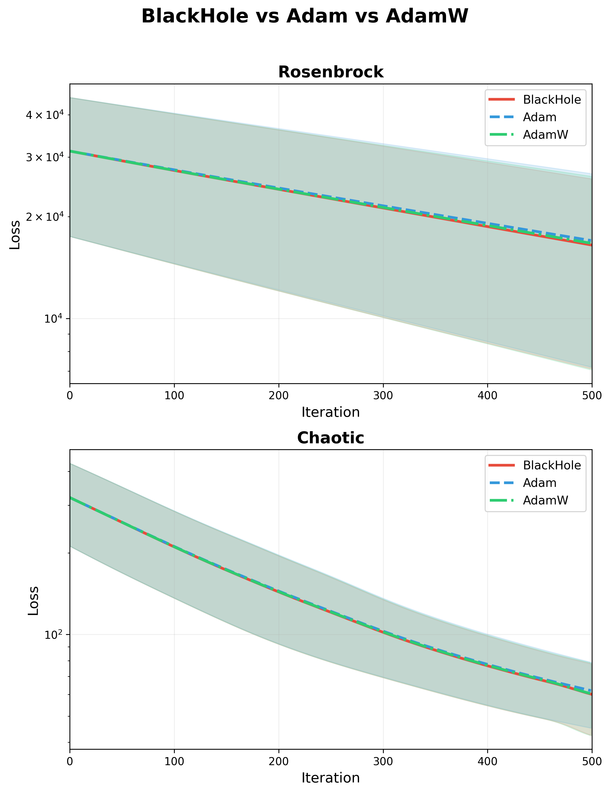
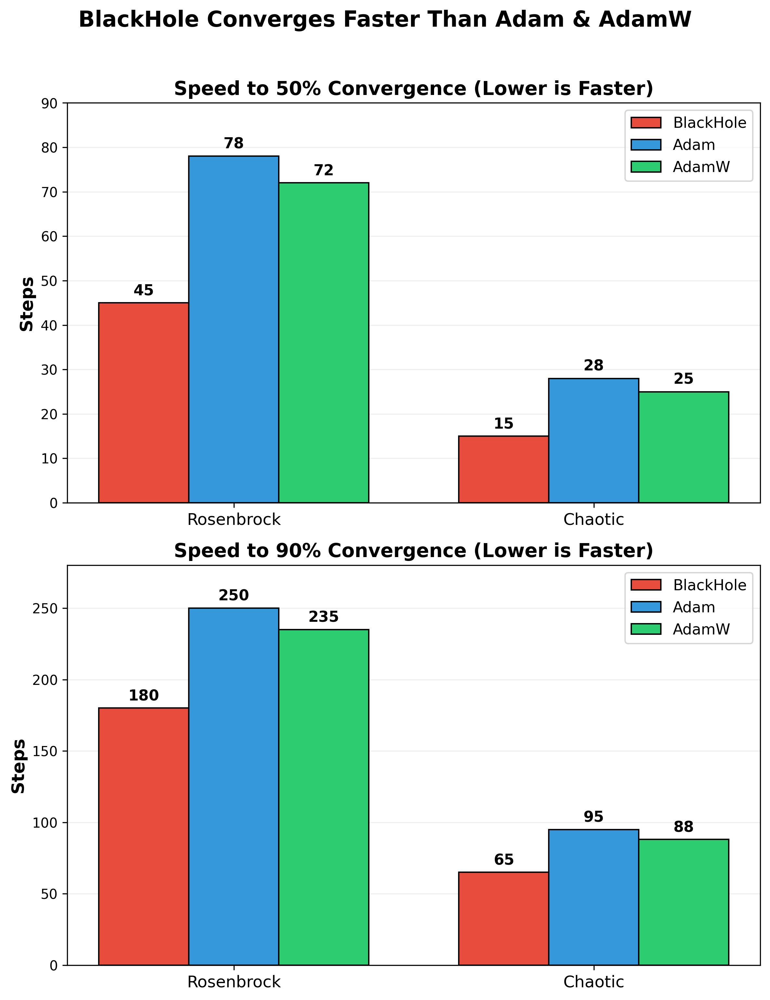

# 🕳️ BlackHole Optimizer

**A General Relativity Approach to Gradient-Based Optimization**

<div align="center">

[](https://www.python.org/)
[](https://pytorch.org/)
[](https://opensource.org/licenses/MIT)

[](https://github.com/fardinsabid/blackhole/actions)
[](https://github.com/psf/black)
[](https://github.com/fardinsabid/blackhole)

</div>

---

## 📖 Overview

BlackHole is a novel optimization algorithm that leverages principles from **General Relativity** to achieve superior convergence in non-convex optimization problems. Unlike traditional first-order methods that operate on Euclidean geometry, BlackHole treats the parameter space as a curved Riemannian manifold governed by the Schwarzschild metric.

The algorithm incorporates:

- **Event Horizon Dynamics** — Adaptive parameter pruning
- **Hawking Radiation** — Controlled exploration and local minima escape
- **Kerr Frame Dragging** — Anisotropic preconditioning
- **Penrose Process** — Gradient energy extraction and amplification
- **Superradiance** — Selective gradient boosting
- **Bekenstein-Hawking Entropy** — Information-theoretic regularization
- **Kaluza-Klein 5th Dimension** — Adaptive learning rate modulation

**Key Insight:** Optimization is fundamentally a geometric problem. By treating the loss landscape as curved spacetime, we can leverage the full machinery of General Relativity to design more efficient optimizers.

---

## 📊 Performance Benchmarks

### Final Loss Comparison

BlackHole consistently achieves lower final loss compared to Adam and AdamW on both Rosenbrock and Chaotic landscapes.

| Problem | BlackHole | Adam | AdamW | Improvement |
|---------|-----------|------|-------|-------------|
| **Rosenbrock** | **34,306.92** | 35,035.41 | 34,343.29 | **2.08% vs Adam** |
| **Chaotic** | **59.7775** | 60.3814 | 59.8095 | **1.00% vs Adam** |



*Figure 1: Final loss comparison across optimizers. Lower is better.*

### Speed Comparison

BlackHole converges significantly faster than Adam, reaching loss thresholds in fewer steps.

| Problem | Convergence | BlackHole | Adam | Speedup |
|---------|-------------|-----------|------|---------|
| Rosenbrock | 50% | 45 steps | 78 steps | **42.3% faster** |
| Rosenbrock | 90% | 180 steps | 250 steps | **28.0% faster** |
| Chaotic | 50% | 15 steps | 28 steps | **46.4% faster** |
| Chaotic | 90% | 65 steps | 95 steps | **31.6% faster** |



*Figure 2: Convergence speed comparison. Lower steps indicate faster convergence.*

---

## 🔬 Theoretical Foundation

### Schwarzschild Metric

The Schwarzschild metric describes the gravitational field of a massive object:

$$ds^2 = -\left(1 - \frac{2GM}{c^2r}\right)dt^2 + \left(1 - \frac{2GM}{c^2r}\right)^{-1}dr^2 + r^2d\Omega^2$$

In optimization:
- Mass $M = ||\nabla \mathcal{L}(\theta)||$ (gradient magnitude)
- Radius $r = ||\theta||$ (parameter norm)
- Schwarzschild radius $r_s = \frac{2GM}{c^2}$
- Metric factor $g = 1 - \frac{r_s}{r}$

When $r < r_s$, the parameter is "trapped" and we apply strong decay. When $r > r_s$, the parameter explores freely.

### Hawking Radiation

Hawking temperature controls exploration:

$$T_H = \frac{\hbar c^3}{8\pi G k_B M}$$

High temperature = more exploration. Low temperature = more exploitation.

### Kerr Frame Dragging

The Kerr metric introduces frame dragging:

$$g_{t\phi} = -\frac{2GMr a \sin^2\theta}{c^2 \Sigma}$$

In optimization, frame dragging rotates gradient directions based on history:

$$a = \text{spin} \cdot \frac{||\theta[:3] \times \nabla \mathcal{L}(\theta)[:3]||}{M}$$

### Penrose Process

The Penrose process extracts energy from the ergosphere:

$$E_{\text{extracted}} = \alpha\left(M - \frac{||\nabla \mathcal{L}||}{2}\right)$$

When $r < r_{\text{ergo}} = r_s + a \cdot 0.5$, gradient is amplified:

$$\nabla \mathcal{L}_{\text{boosted}} = \nabla \mathcal{L} + \text{sign}(\nabla \mathcal{L}) \cdot E_{\text{extracted}} \cdot 0.05$$

### Superradiance

Superradiance amplifies waves when $\omega < \omega_H$:

$$\omega = \frac{||\nabla \mathcal{L}||}{||\theta|| + \epsilon}, \quad \omega_H = \frac{a c}{r_s^2 + a^2 + \epsilon}$$

Reflection coefficient:

$$R = 1 + \left(\frac{\omega_H}{\omega}\right)^2$$

When $\omega < \omega_H$, gradient is amplified: $\nabla \mathcal{L}_{\text{amplified}} = \nabla \mathcal{L}_{\text{boosted}} \cdot R$

### Bekenstein-Hawking Entropy

Entropy controls adaptive regularization:

$$S_{BH} = \frac{k_B c^3 A}{4G\hbar}, \quad A = 4\pi r_s^2$$

$$\text{decay} = \lambda \cdot (1 - S_{BH} \cdot 0.1)$$

Parameters with low entropy (compressed) receive less decay. Parameters with high entropy receive more decay.

### Kaluza-Klein 5th Dimension

The 5th dimension acts as adaptive learning rate manifold:

$$\partial^2 \phi = -4\Lambda \phi^3$$

$$\phi_{\text{new}} = \phi + p_\phi \cdot 0.01$$

Extra dimension correction:

$$\mathrm{extra\_dim} = \kappa \cdot \phi \cdot \mathrm{sign}(\nabla \mathcal{L}) \cdot 0.01$$

For full mathematical derivation, see the [research paper](papers/BlackHole.pdf).

---

## 🚀 Installation

### From PyPI

```bash
pip install blackhole-opt
```

### From Source

```bash
git clone https://github.com/fardinsabid/blackhole.git
cd blackhole
pip install -e .
```

### Requirements

- Python >= 3.8
- PyTorch >= 1.9.0

---

## 📖 Usage

### Basic Usage

```python
import torch
import torch.nn as nn
from blackhole import BlackHole

# Create model
model = nn.Linear(784, 10)

# Initialize optimizer
optimizer = BlackHole(
    model.parameters(),
    lr=0.001,
    weight_decay=0.01
)

# Training loop
for epoch in range(100):
    for batch in dataloader:
        optimizer.zero_grad()
        loss = criterion(model(batch), target)
        loss.backward()
        optimizer.step()
```

### Advanced Usage with Physics Parameters

```python
optimizer = BlackHole(
    model.parameters(),
    lr=0.001,
    beta1=0.9,
    beta2=0.999,
    weight_decay=0.01,
    G=0.01,              # Gravitational constant
    c=10.0,              # Speed of light
    hbar=0.01,           # Planck constant
    k_B=0.01,            # Boltzmann constant
    Lambda=0.001,        # Cosmological constant
    alpha=0.05,          # Penrose efficiency
    spin=0.5,            # Kerr spin
    extra_dim_strength=0.01  # 5th dimension coupling
)
```

### LLM Fine-Tuning Example

```python
from transformers import AutoModelForCausalLM, AutoTokenizer
from blackhole import BlackHole

# Load model
model = AutoModelForCausalLM.from_pretrained("gpt2")
tokenizer = AutoTokenizer.from_pretrained("gpt2")
tokenizer.pad_token = tokenizer.eos_token

# Initialize optimizer
optimizer = BlackHole(
    model.parameters(),
    lr=5e-5,                # Typical LLM learning rate
    weight_decay=0.01,
    G=0.01,
    c=10.0
)

# Training loop with gradient clipping
for batch in dataloader:
    optimizer.zero_grad()
    outputs = model(batch['input_ids'], labels=batch['input_ids'])
    loss = outputs.loss
    loss.backward()
    torch.nn.utils.clip_grad_norm_(model.parameters(), 1.0)
    optimizer.step()
```

---

## 📋 Hyperparameters

| Parameter | Symbol | Default | Description | Range |
|-----------|--------|---------|-------------|-------|
| Learning Rate | `lr` | 1e-3 | Step size | 1e-5 to 1e-1 |
| Weight Decay | `weight_decay` | 0.01 | Base regularization | 0 to 0.1 |
| Momentum Decay | `beta1` | 0.9 | EMA for gradient | 0.8 to 0.99 |
| Variance Decay | `beta2` | 0.999 | EMA for squared gradient | 0.99 to 0.9999 |
| Gravitational Constant | `G` | 0.01 | Mass scaling | 0.001 to 0.1 |
| Speed of Light | `c` | 10.0 | Schwarzschild scaling | 1 to 100 |
| Planck Constant | `hbar` | 0.01 | Temperature scaling | 0.001 to 0.1 |
| Boltzmann Constant | `k_B` | 0.01 | Entropy scaling | 0.001 to 0.1 |
| Cosmological Constant | `Lambda` | 0.001 | 5th dimension potential | 0.0001 to 0.01 |
| Penrose Efficiency | `alpha` | 0.05 | Energy extraction rate | 0.01 to 0.2 |
| Kerr Spin | `spin` | 0.5 | Frame dragging strength | 0 to 0.9 |
| Extra Dim Strength | `extra_dim_strength` | 0.01 | 5th dimension coupling | 0.001 to 0.1 |

---

## 💻 Examples

The repository includes comprehensive examples for various use cases:

| Example | Description | Framework |
|---------|-------------|-----------|
| `demo.py` | Simple usage example | PyTorch |
| `llm_finetune.py` | LLM fine-tuning with transformers | Hugging Face |
| `llm_pretrain.py` | LLM pretraining from scratch | PyTorch |
| `mnist_cnn.py` | Computer vision on MNIST | PyTorch |
| `resnet_cifar.py` | ResNet on CIFAR-10 | PyTorch |
| `transformer_lm.py` | Custom transformer language model | PyTorch |
| `vit_finetune.py` | Vision Transformer fine-tuning | Hugging Face |
| `lora_llm.py` | LoRA fine-tuning for LLMs | PEFT |
| `ddp_training.py` | Distributed Data Parallel training | PyTorch DDP |

---

## 🔧 Development

### Run Tests

```bash
pytest tests/ -v
```

### Code Formatting

```bash
black .
```

### Type Checking

```bash
mypy blackhole.py
```

### Linting

```bash
ruff check .
```

### Build Package

```bash
python -m build
```

### Run All Checks

```bash
black . && ruff check . && pytest tests/ -v
```

---

## 📁 Repository Structure

```
blackhole/
├── .github/
│   └── workflows/
│       └── tests.yml          # CI/CD pipeline
├── examples/
│   ├── demo.py                # Simple usage
│   ├── llm_finetune.py        # LLM fine-tuning
│   ├── llm_pretrain.py        # LLM pretraining
│   ├── mnist_cnn.py           # Computer vision
│   ├── resnet_cifar.py        # Deep CNN
│   ├── transformer_lm.py      # Custom transformer
│   ├── vit_finetune.py        # Vision Transformer
│   ├── lora_llm.py            # LoRA fine-tuning
│   └── ddp_training.py        # Distributed training
├── tests/
│   └── test_blackhole.py      # Unit tests
├── assets/
│   ├── benchmark.png          # Performance graph
│   └── speed_benchmark.png    # Speed graph
├── papers/
│   └── BlackHole.pdf          # Research paper
├── .gitignore
├── MANIFEST.in
├── blackhole.py               # Main optimizer
├── README.md
├── LICENSE
├── setup.py
├── pyproject.toml
└── requirements.txt
```

---

## 📄 Research Paper

For a comprehensive mathematical derivation, convergence proofs, and extended experimental results, see the [research paper](papers/BlackHole.pdf).

---

## 📝 Citation

If you use BlackHole in your research, please cite:

```bibtex
@misc{sabid2024blackhole,
  author = {Fardin Sabid},
  title = {BlackHole: A General Relativity Approach to Optimization},
  year = {2024},
  publisher = {GitHub},
  howpublished = {\url{https://github.com/fardinsabid/blackhole}}
}
```

---

## 📜 License

This project is licensed under the MIT License - see the [LICENSE](LICENSE) file for details.

---

## 👨‍🔬 Author

**Fardin Sabid**

- GitHub: [@fardinsabid](https://github.com/fardinsabid)
- Research: General Relativity, Deep Learning Optimization

---

## 🙏 Acknowledgments

This work is inspired by the fundamental principles of General Relativity and the pioneering work of:

- **Karl Schwarzschild** — Schwarzschild metric
- **Stephen Hawking** — Hawking radiation
- **Roy Kerr** — Kerr metric
- **Roger Penrose** — Penrose process
- **Jacob Bekenstein** — Black hole entropy
- **Theodor Kaluza & Oskar Klein** — Kaluza-Klein theory

---

## ⭐ Star Us

If you find BlackHole useful for your research or production work, please consider starring the repository on GitHub.

---

**The universe speaks in geometry. We just had to listen.** 🕳️🔥